#  Zhuo Chen | Motivation Video & Portfolio

> **Applicant for BA Game Design (Game Art) | Cologne Game Lab (CGL)**

 

Welcome to my backup portfolio. This page serves as a reliable mirror of my work and design philosophy, ensuring accessibility when Vercel does not work.

 

✨ **[View My Portfolio Website Here](https://zhuochen.vercel.app)** (Recommended for the full experience)

 

---
 

## 📺 Motivation Video
This video introduces my background and my passion for studying at CGL.

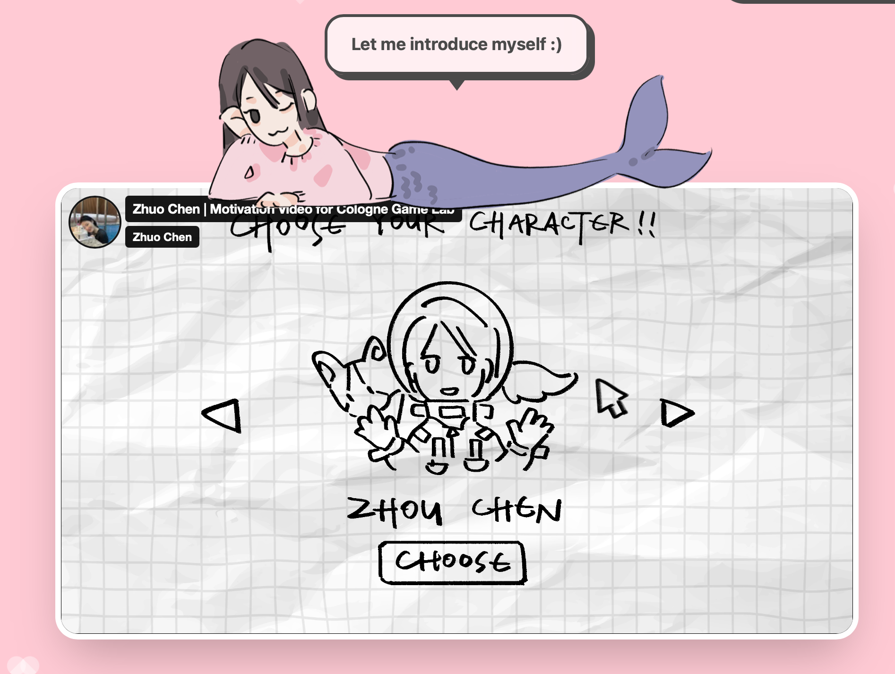

*Please: [Watch on Vimeo](https://vimeo.com/1178229615)*

 

---

 

## HERE IS MY PORTFOLIO 🎨

Let’s start with two characters I designed for my indie game, *Lucky Bunny’s Foot*.

 

### 01. Lucky Bunny
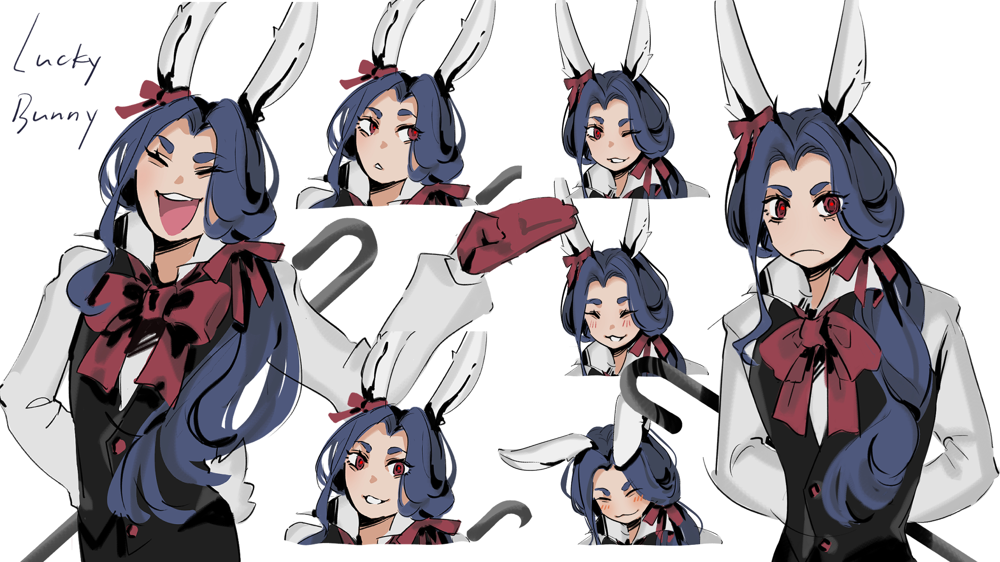

Meet Lucky Bunny 🐰. He is a mysterious young man with rabbit ears. He is mischievous and constantly seeking validation. I designed his magician-inspired outfit and bows to give him a fairy-tale-like charm.

 

### 02. Darwin
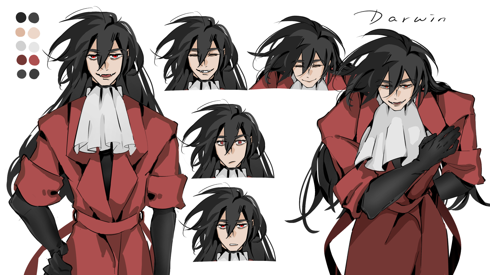

This is Darwin, a resurrected vampire working as a supernatural agent and the player's partner. By blending an elegant long coat and a black tactical outfit, I aimed to create a subtle balance between "playful and dangerously powerful" and "safely reliable."

 

### And here are some of my practices.

All illustrations are created with Clip Studio Paint and Procreate.

 

### 03. Figure Drawing (Female)
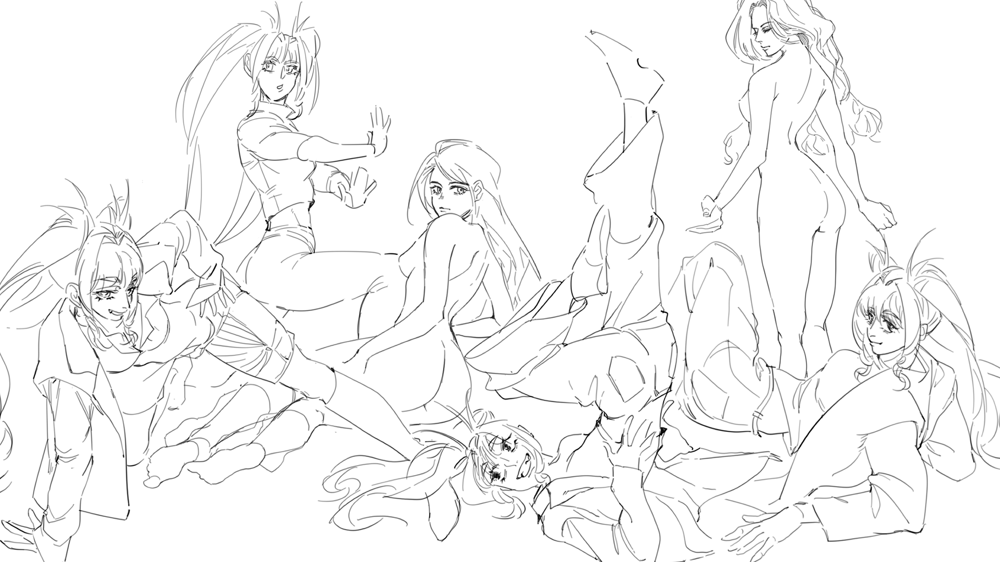

Beyond physical accuracy, I also focus on those expressive facial details.

 

### 04. Figure Drawing (Male)
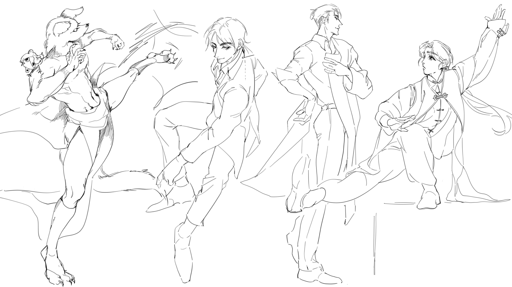

A continuous study of muscle structure. If I stop practicing for some days, the details fade.

 

### 05. Color & Tone
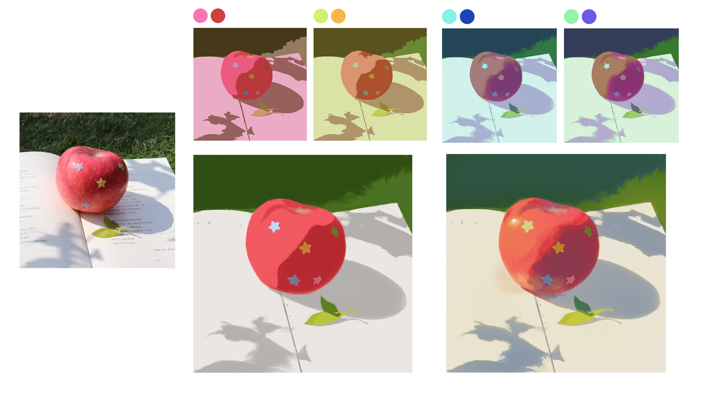

Can an apple be so colorful? 

 

### 06. Object & Ambient Light
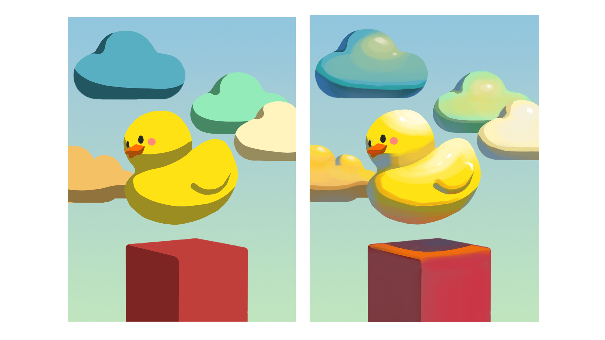

A study of how objects react and shift color in saturated environments.

 

### 07. Character & Ambient Light
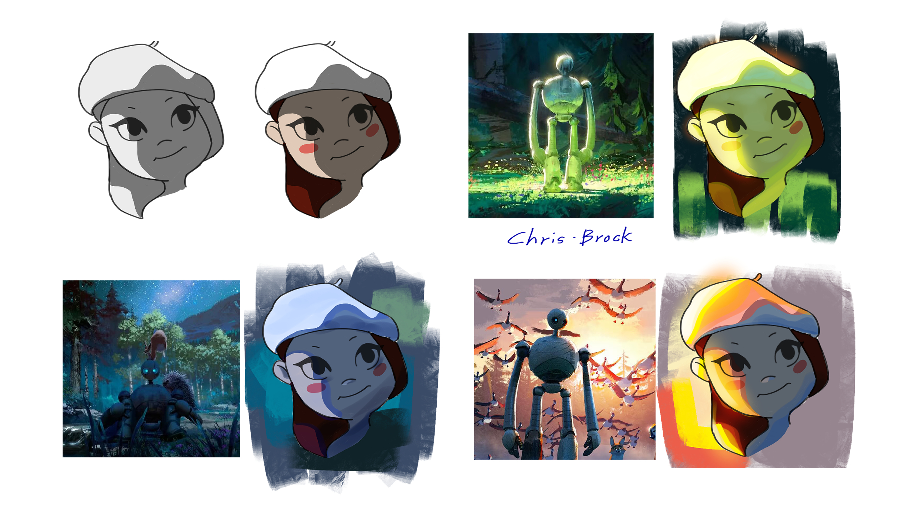

A study of how to render characters under colored ambient lighting.

 

### 08. Character & Environment
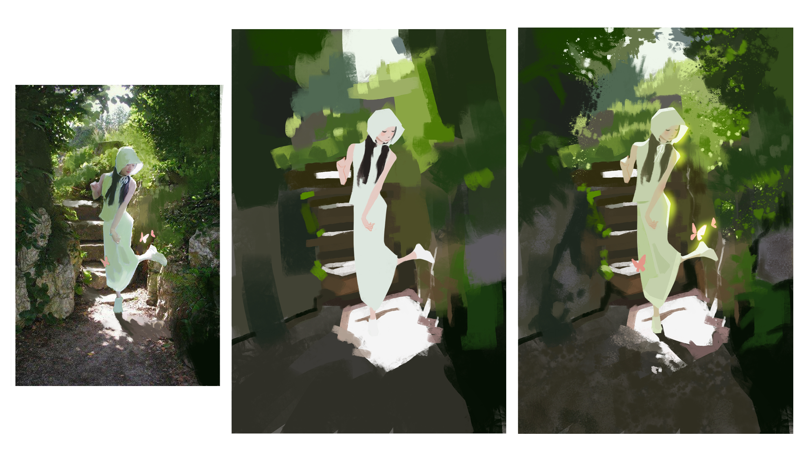

A complete illustration combining character and scene.

 

### 09. Environment & Lighting
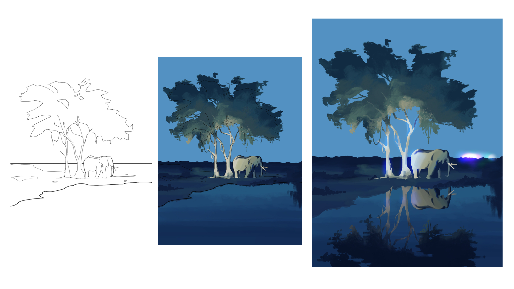

A study of lighting in an African landscape at night, also including distant city lights and reflections on water.

 

### 10. Environment & Mood
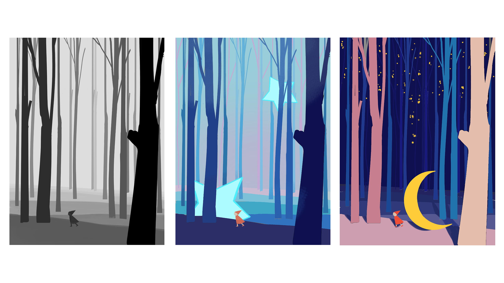

One of my favorite pieces. I experimented with different color schemes to create different atmospheres for the same scene.

 

---

 

## Links

 

- **My Portfolio Website:** [Vercel Link](https://zhuochen.vercel.app)
  
- **Motivation Video on Vimeo:** [Zhuo Chen](https://vimeo.com/1178229615)

 

---
*Thank you for watching! Hope we will meet again soon^^*

 

*Designed & Built with 💖.*
